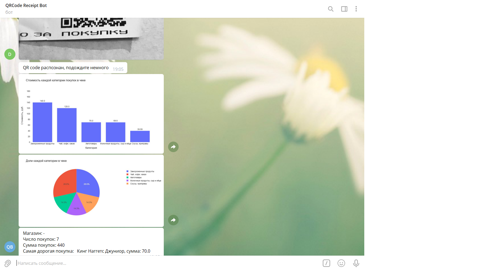

# Бот в Telegram, который распределяет товары из чека по категориям
P.S. Работает только с продуктами питания
### Пример работы:

### Установка:
1. pip install -r requirements.txt из cmd
2. Создать файл .env
3. Создание telegram бота у BotFather
4. Получить ИНН и пароль от https://lkfl2.nalog.ru/lkfl/login
5. Заполнить файл .env
##### Вид файла .env:
```
CLIENT_SECRET=IyvrAbKt9h/8p6a7QPh8gpkXYQ4=  
INN=  
PASSWORD=  
BOT_TOKEN=
```
*(CLIENT_SECRET уже подставлен)*